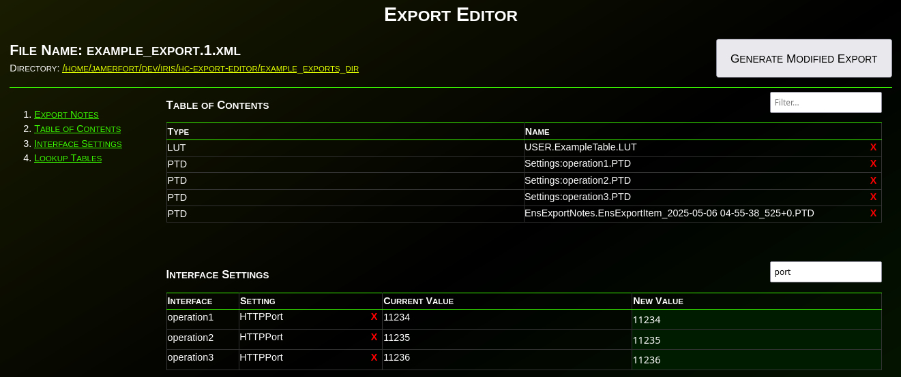
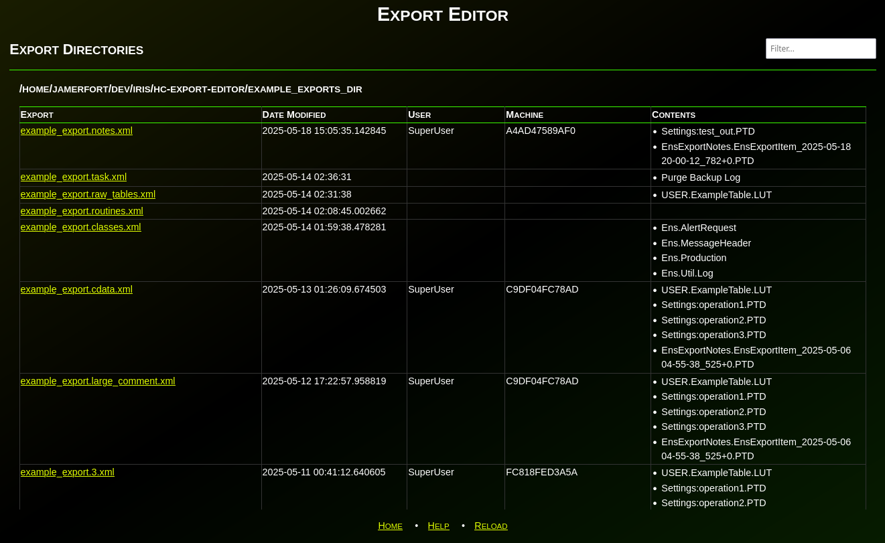
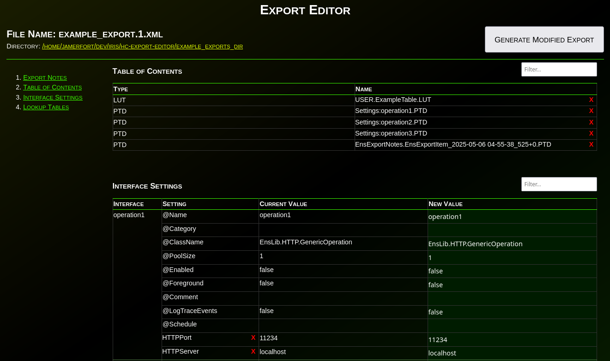
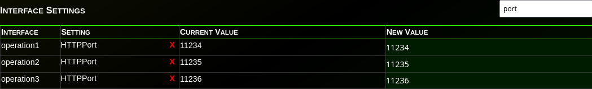

# hc-export-editor
An InterSystems IRIS/Health Connect Production Export Editor



Have you ever needed to change an IP or port before deploying an interface to production?  What about modifying the value(s) in a lookup table before deploying?  Have you wanted to disable an interface before deploying?  What about adding a comment, category, or alert setting to an interface before deploying to production?

If you've ever needed to make any changes to an interface or lookup table before deploying to production, this `Export Editor` is for you!

### InterSystems FHIR and Digital Health Interoperability Contest 2025
This library was originally created/published for the [InterSystems FHIR and Digital Health Interoperability Contest 2025](https://community.intersystems.com/post/intersystems-fhir-and-digital-health-interoperability-contest-2025).

## Description

`Export Editor` is a WSGI web application that provides a method for editing exports before deploying them to an IRIS/Health Connect production.

This tool allows you to:
  - change any setting on an interface (whether a Business Service, Process, or Operation)
  - modify any value in a lookup table.

## Prerequisites
- IRIS 2022.1+ (for Embedded Python support)
- Python 3 installed on the system

## Installation

There are several methods for installing this library:
1. Run the application directly by python.
2. Docker
3. Install the IPM/ZPM package 
4. Manually Install as an IRIS WSGI application

### Option 1: Run the application directly by python.

Clone the repository:
```bash
git clone https://github.com/jamerfort/hc-export-editor.git
```

Navigate to the `hc_export_editor` directory:
```bash
cd hc_export_editor
```

Before you run the application, you must setup all dependencies (venv, python packages, etc.):
```bash
./setup.sh
```

To run the development server provided with python/flask:
```bash
./run.sh
# Or
./run.sh -h <IPADDRESS> -p <PORT>
```

Now open a browser and navigate to http://localhost:5000 (or whichever host/port you used).

### Option 2: Docker

If you prefer, you can demo `Export Editor` with docker.

First, download/clone the repo to your local computer:

```bash
git clone https://github.com/jamerfort/hc-export-editor.git
```
Build and connect to your instance:

```bash
cd ./hc-export-editor

# Rebuild/start the image
docker compose up --build -d
```

Access the demo at http://localhost:55038/hc-export-editor/exports.

Stop your instance:

```bash
# Stop your containers
docker compose down 
```

### Option 3: Install the IPM/ZPM package 

Once the package is approved for ZPM, use `zpm` to install the `hc-export-editor` package:
```cls
USER>zpm

=============================================================================
|| Welcome to the Package Manager Shell (ZPM). version 0.7.4               ||
|| Enter q/quit to exit the shell. Enter ?/help to view available commands ||
|| Current registry https://pm.community.intersystems.com                  ||
=============================================================================
zpm:USER>install hc-export-editor
```
### Option 4: Manually Install as an IRIS WSGI application
First, download/clone the repo:

```bash
git clone https://github.com/jamerfort/hc-export-editor.git
```

Install the required python modules:

```bash
python3 -m pip install --target /InterSystems/IRIS/mgr/python -r hc-export-editor/requirements.txt
```

Navigate to `System Adminstration > Security > Applications >  Web Applications` in IRIS/Health Connect. Click `Create New Web Application`.

Fill in the following fields:

> **Name**: /hc-export-editor  
> **Description**: An InterSystems IRIS/Health Connect Production Export Editor  
> **Namespace**: [Your Desired Namespace]  
> **Enable Application**: ✓ [Checked]  
> 
> **WSGI [Experimental]**: ✓ [Checked]  
>> **Application Name**: app  
>> **Callable Name**: app  
>> **WSGI App Directory**: /path/to/hc-export-editor/webapps/hc_export_editor  
> 
> **Security Settings**:  
>> **Allowed Authentication Methods**: [Choose appropriate auth methods, such as "Password"]

Set any additional parameters as desired.

Click `Save` button.

## Configuration
By default, `Export Editor` looks in the following directories for any xml files:
- {IRIS_INSTALLDIR}/exports
- {IRIS_INSTALLDIR}/mgr/exports

If you would like to customize which directories `Export Editor` will manage, you can either update the `EXPORT_DIRS` environment variable or edit the `^hc.export.editor.config("dirs")` global in the namespace running the application.  The values of this environment variable or global is a list of directories, separated by the OS path separator (semi-colon (`;`) on Windows, colon (`:`) on Unix/Linux/Posix).

For example:
| OS | Sep | Method | Name | Value |
|----|-----|--------|------|-------|
|Windows|;|Environment Variable|`EXPORT_DIRS`|`C:\path\to\exports1;D:\another\path\to\exports`|
|Windows|;|Global|`^hc.export.editor.config("dirs")`|`C:\path\to\exports1;D:\another\path\to\exports`|
|Linux|:|Environment Variable|`EXPORT_DIRS`|`/path/to/exports1:/another/path/to/exports`|
|Linux|:|Global|`^hc.export.editor.config("dirs")`|`/path/to/exports1:/another/path/to/exports`|

Setting the `^hc.export.editor.config("dirs")` global takes precedence over the `EXPORT_DIRS` environment variable.  If either are set, `Export Editor` will *NOT* look in the default directories found under `{IRIS_INSTALLDIR}`.

Once you've made a change to either the global or environment variable, be sure to either restart your instance or visit the `/hc-export-editor/reload` endpoint to trigger a configuration reload.

## Usage

### Listing Exports
The `/hc-export-editor/exports` page lists all of the XML files found in the configured directories.  Click on an export to modify.



### Modifying an Export
The `/hc-export-editor/exports/<dir-id>/<file-id>` page allows you to modify the given XML export file.



This page contains various sections, each with its own table and filter box.

The filter box allows you to narrow down the display to only the rows you are interested in viewing or editing.

Most tables have a `New Value` column that is editable.  Changing the values in this column will change the corresponding value in the generated, modified export.  Use the `tab` key to jump from editable cell to editable cell.

Each Interface Setting can be removed from the export by clicking on the red `X` next to the setting names.

#### Header Section
This section contains the file name of the export being modified and the directory that contains the export.


The `Directory` link will take you back to the `hc-export-editor/exports` page, that lists all the configured directories and their contents.

#### "Export Notes" Section
This section of the editor displays the settings related to the export, such as Production, Namespace, User, etc.  You can use the filter box to the top-right to search the list of export fields.


#### "Contents" Section
This section of the editor displays the list of items included in the selected export.  You can use the filter box to the top-right to search the list of contents.  You can not currently edit the list of items in the export.


#### "Interface Settings" Section
This section of the editor allows you to edit the various settings and attributes of any interfaces (Business Services, Processes, or Operations) included in the export.


You can use the filter box to the top-right to narrow down the list of displayed settings.  For example, if you type "port", the "Interface Settings" table will only show settings with "port" in the name.



You can also remove settings from the export by clicking the red `X` next to each setting name.

#### "Lookup Tables" Section
This section of the editor allows you to edit the values of any lookup tables included in the export.

You can use the filter box to the top-right to narrow down the list of displayed rows.


You can also individual rows from the export by clicking the red `X` next to each row's key.

#### Saving the Changes
After you've made changes to the settings in the tables above, you can either type `Enter` (while in an text box or editable field) or you can click the `Generate Modified Export` button at the top-right of the page.


Submitting the page (by hitting `Enter` or the `Generate Modified Export` button) will prompt your browser to download an XML file.  This XML export should contain your modifications and be ready to deploy to your environment.